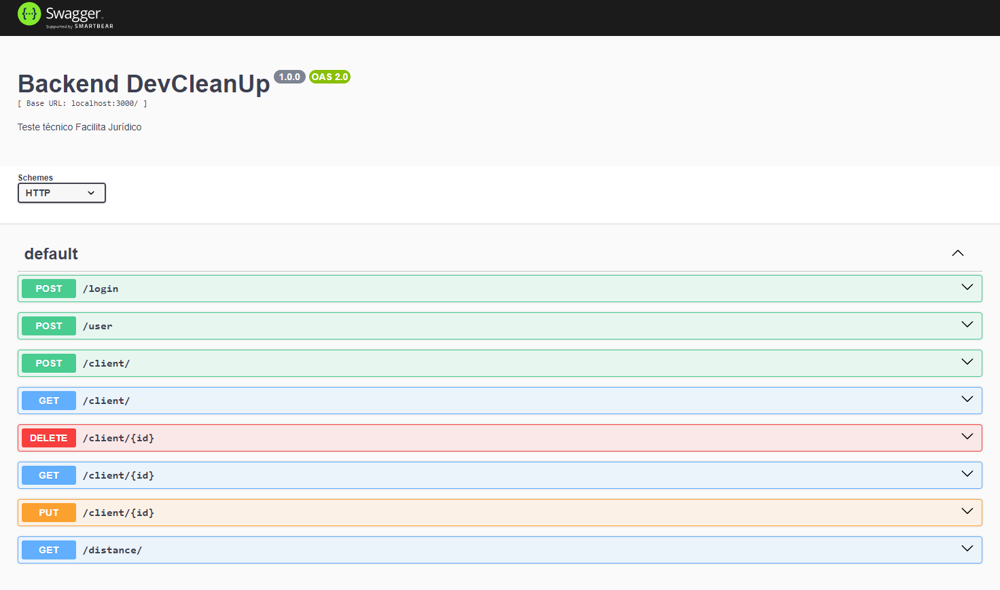

# Dev Clean Up

This is an API building with Express aiming to control clients in a system.

| Dependency         | Version |
| ------------------ | ------- |
| bcrypt             | 5.1.1   |
| cors               | 2.8.5   |
| dotenv             | 16.4.1  |
| express            | 4.18.2  |
| jsonwebtoken       | 9.0.2   |
| pg                 | 8.11.3  |
| swagger-autogen    | 2.23.7  |
| swagger-ui-express | 5.0.0   |

**Dev Dependencies**

| Dependency | Version |
| ---------- | ------- |
| nodemon    | 3.0.3   |

## Getting Started

1 - Clone the project:

You can use this CLI command on your terminal:

```bash
git clone https://github.com/Daaaiii/backend-DevCleanUp.git
```

2 - Install the dependencies:

```bash
npm install
# or
yarn install
# or
pnpm install
# or
bun install
```

3 - Run the development server:

```bash
npm run dev
# or
yarn dev
# or
pnpm dev
# or
bun dev
```
4 - Swagger documentation
 The api has an script to generate Swagger automatically once the api starts.

Open [http://localhost:3001/doc](http://localhost:3001/doc) with your browser to see the documentation of the api and all the endpoints available .

